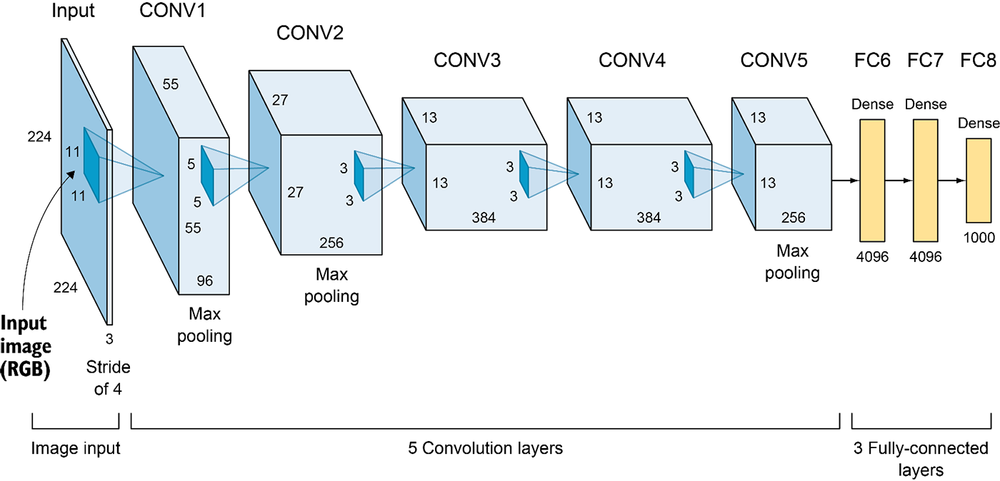

# AlexNet

## Background

This is a Pytorch implementation of the famous paper ["ImageNet Classification with Deep Convolutional Neural Networks"](https://papers.nips.cc/paper/2012/file/c399862d3b9d6b76c8436e924a68c45b-Paper.pdf) by Alex Krizhevsky, Ilya Sutskever and Geoffrey E. Hinton or, as the architecture described within is more commonly know, AlexNet.

## The Architecture



## Deviations From the Paper

I have remained as faithful as is reasonable to the original paper however it is no longer 2012.
In the original paper the authors had to contend with the limitations of contemporary graphics cards such as the GTX 580 which had a measly 3GB of graphics memory and to do this they opted to implement a parallelization scheme where they split the model across two separate GPUs with the two communicating only on certain layers.
It would have been somewhat foolish to recreate this "hack" they implemented to cope with limitations that are no longer extant (The RTX 2070 in my laptop alone has 8GB of graphics RAM!) so as a result in my implementation I have opted to remove it.
Rather than having two separate, parallel network paths I have merged the corresponding layers into singular layers of the equivalent size.
I apologize if you were in search of an implementation of this particular part of their architecture, you shall not find it here!

## Dataset


## Requirements

All you need to run this code are the torch and torchvision libraries.
To install these just run the following command in the root of your local copy of the repo.
Do bear in mind though that you may wish to visit the pytorch website to download the most appropriate versions for your system.
```
sudo pip3 install -r ./requirements.txt
```
